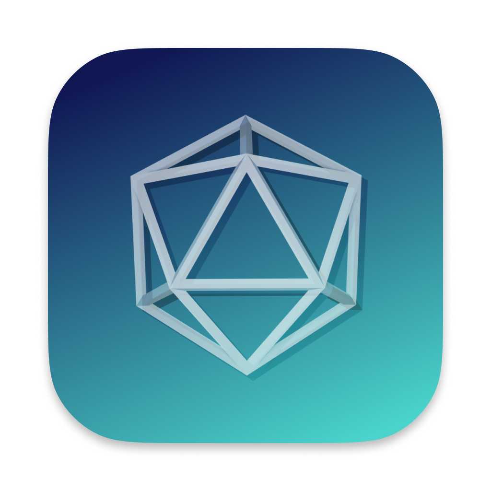

<!-- Improved compatibility of back to top link: See: https://github.com/othneildrew/Best-README-Template/pull/73 -->

<!--
*** Thanks for checking out the Best-README-Template. If you have a suggestion
*** that would make this better, please fork the repo and create a pull request
*** or simply open an issue with the tag "enhancement".
*** Don't forget to give the project a star!
*** Thanks again! Now go create something AMAZING! :D
-->

<!-- PROJECT SHIELDS -->
<!--
*** I'm using markdown "reference style" links for readability.
*** Reference links are enclosed in brackets [ ] instead of parentheses ( ).
*** See the bottom of this document for the declaration of the reference variables
*** for contributors-url, forks-url, etc. This is an optional, concise syntax you may use.
*** https://www.markdownguide.org/basic-syntax/#reference-style-links
-->
[![Contributors][contributors-shield]][contributors-url]
[![Forks][forks-shield]][forks-url]
[![Stargazers][stars-shield]][stars-url]
[![Issues][issues-shield]][issues-url]
[![GPLv3 License][license-shield]][license-url]

<!-- PROJECT LOGO -->
 

  <a href="https://github.com/github_username/repo_name">
    <!--  -->
  </a>

<h3 align="center">Project Raphael</h3>

  

    For the end of year project, our plan is to create artificial intelligence that contains many functionalities. 
     
    <!-- <a href="https://github.com/ZhichGaming/Project-Raphael"><strong>Explore the docs »</strong></a> -->
     
     
<!--     <a href="https://github.com/github_username/repo_name">View Demo</a>
    · -->
    <a href="https://github.com/ZhichGaming/Project-Raphael/issues">Report Bug</a>
    ·
    <a href="https://github.com/ZhichGaming/Project-Raphael/issues">Request Feature</a>
  

<!-- TABLE OF CONTENTS -->

  
Table of Contents

  <ol>
    <li>
      <a href="#about-the-project">About The Project</a>
      <ul>
        <li><a href="#built-with">Built With</a></li>
      </ul>
    </li>
    <li>
      <a href="#getting-started">Getting Started</a>
      <ul>
        <li><a href="#prerequisites">Prerequisites</a></li>
        <li><a href="#installation">Installation</a></li>
      </ul>
    </li>
    <li><a href="#usage">Usage</a></li>
    <li><a href="#roadmap">Roadmap</a></li>
    <li><a href="#contributing">Contributing</a></li>
    <li><a href="#license">License</a></li>
    <li><a href="#contact">Contact</a></li>
    <li><a href="#acknowledgments">Acknowledgments</a></li>
  </ol>

<!-- ABOUT THE PROJECT -->
## About The Project

<!-- [![App Image][product-screenshot]](https://example.com) -->

An AI-powered multi-platform app that can interact with the filesystem and execute commands. Built as our secondary 4 final CS project.

(<a href="#readme-top">back to top</a>)

### Built With

* [![Next][Next.js]][Next-url]
* [![React][React.js]][React-url]
* [![Tauri][Tauri]][Tauri-url]
* [![Threejs][Threejs]][Threejs-url]

(<a href="#readme-top">back to top</a>)

<!-- GETTING STARTED -->
## Getting Started

To get a local copy up and running follow these simple steps. Contact us through discord for more information.

### Prerequisites

- Git
- Node Package Manager (NPM)

### Running
1. Navigate to the folder you want the project to be located in using terminal.
2. Run `git clone https://github.com/ZhichGaming/Project-Raphael.git`.
3. Run `npm i` to install dependancies.
4. Install VScode extensions:
	1. Tauri
	2. rust-analyzer
5. Run `npm run tauri dev`.

### Building
- Run `npm run tauri build`.

(<a href="#readme-top">back to top</a>)

<!-- CONTRIBUTING -->
## Contributing

Contributions are what make the open source community such an amazing place to learn, inspire, and create. Any contributions you make are **greatly appreciated**.

If you have a suggestion that would make this better, please fork the repo and create a pull request. You can also simply open an issue with the tag "enhancement".
Don't forget to give the project a star! Thanks again!

1. Fork the Project
2. Create your Feature Branch (`git checkout -b feature/AmazingFeature`)
3. Commit your Changes (`git commit -m 'Add some AmazingFeature'`)
4. Push to the Branch (`git push origin feature/AmazingFeature`)
5. Open a Pull Request

(<a href="#readme-top">back to top</a>)

<!-- LICENSE -->
## License

Distributed under the GNU General Public License v3.0 (GPLv3). See `LICENSE` for more information.

(<a href="#readme-top">back to top</a>)

<!-- CONTACT -->
## Contact

You can contact us through Discord or through email if you'd like.
- @ZhichGaming - zhich - nick.zhicheng@gmail.com
- @Nvadidivan - nvadidivan

Project Link: [https://github.com/ZhichGaming/Project-Raphael](https://github.com/ZhichGaming/Project-Raphael)

(<a href="#readme-top">back to top</a>)

<!-- ACKNOWLEDGMENTS -->
## Acknowledgments

(<a href="#readme-top">back to top</a>)

<!-- MARKDOWN LINKS & IMAGES -->
<!-- https://www.markdownguide.org/basic-syntax/#reference-style-links -->
[contributors-shield]: https://img.shields.io/github/contributors/ZhichGaming/Project-Raphael.svg?style=for-the-badge
[contributors-url]: https://github.com/ZhichGaming/Project-Raphael/graphs/contributors
[forks-shield]: https://img.shields.io/github/forks/ZhichGaming/Project-Raphael.svg?style=for-the-badge
[forks-url]: https://github.com/ZhichGaming/Project-Raphael/network/members
[stars-shield]: https://img.shields.io/github/stars/ZhichGaming/Project-Raphael.svg?style=for-the-badge
[stars-url]: https://github.com/ZhichGaming/Project-Raphael/stargazers
[issues-shield]: https://img.shields.io/github/issues/ZhichGaming/Project-Raphael.svg?style=for-the-badge
[issues-url]: https://github.com/ZhichGaming/Project-Raphael/issues
[license-shield]: https://img.shields.io/github/license/ZhichGaming/Project-Raphael.svg?style=for-the-badge
[license-url]: https://github.com/ZhichGaming/
[product-screenshot]: images/screenshot.png
[Next.js]: https://img.shields.io/badge/next.js-000000?style=for-the-badge&logo=nextdotjs&logoColor=white
[Next-url]: https://nextjs.org/
[React.js]: https://img.shields.io/badge/React-20232A?style=for-the-badge&logo=react&logoColor=61DAFB
[React-url]: https://reactjs.org/
[Tauri]: https://img.shields.io/badge/tauri-%2324C8DB.svg?style=for-the-badge&logo=tauri&logoColor=%23FFFFFF
[Tauri-url]: https://tauri.app/
[Threejs]: https://img.shields.io/badge/threejs-black?style=for-the-badge&logo=three.js&logoColor=white
[Threejs-url]: https://threejs.org/
